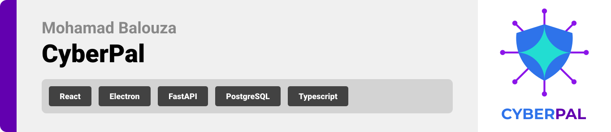
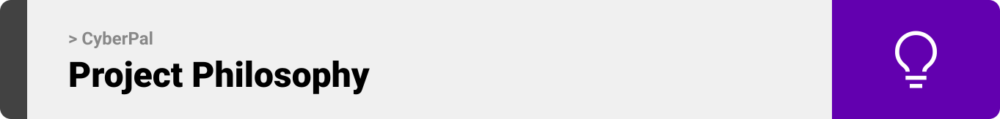
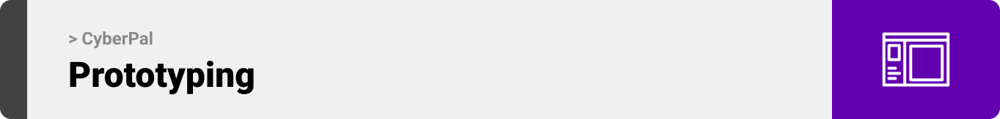
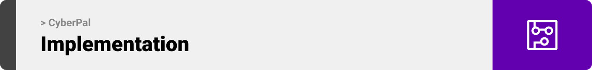

<br><br>

<!-- project philosophy -->


> CyberPal is a desktop application that provides a GUI for various cybersecurity tools (like nmap, netcat, metasploit, tcpdump, etc.), making it easier for users to access and utilize these tools. It also offers scripting and scheduling features for automating user tasks.


### User Stories
- Beginners and Advanced Users:
	- Implementation of vpn connection where the user uploads his own openVPN file given by the popular hacking websites like HackTheBox and Tryhackme, so that it can be activated to be able to hack these boxes on the website directly
	- Implementation of various tools that are necessary for hackers like:
		- Nmap gui where the user provides the ip address and any additional option he wants (like making it silent, etc) and then the scan begins with an automated output that can be downloaded
		- seachsploit gui where it scans for popular exploits of a specific port, and prints out the vulnerabilities and the CVE number and page so you can check the documentation of the exploit and a way to replicate it
		- Metasploit gui where all the exploits, scanners, etc. are navigatable in a good format and after choosing a specific one to run it shows a gui for that option and everything that can be filled inside it to make it working like the target ip and port, the emails or pass that are available etc. and the other options will be filled automatically like the host ip and others depending on the payload
		- Netcat for listening to something on a specific port like reverse shells
		- reverse shells generator gui in almost every given language (chosen in the gui) by the help of PayloadsAllTheThings, and ofcourse with the help of other tools to connect to the server/ip and inject the shell
		- ssh gui where the user just inputs the necessary variables like ip, user and password, and it will give an interface to work on after connecting (and maybe make the other tools work inside the ssh shell) 
		- Scanning the machine that the user is trying to hack after connecting to it with a low level user to give the mistakes in the machine configuration which will provide and automatic privilage escalation to a root user if its possible
		- Burpsuite gui integrated into the website with a simplified form for beginners, and a detailed instructions to get it working in the browser, mostly will be used for capturing traffic and altering it
		- Malware analysis tool if the user already has the file that he wants to check for malware or security issues, it will check for the file in the popular file checking websites to see if anyone has flagged it, and the tool can flag common malware code
		- Snyk tool which will give the user a very good documentation and report on what is wrong with a specific server if the files or github are provided, it could be a security issue with the code like forgetting to sanitize the input, or checking for upload type, MIME, extension etc in the front end and the back end (if it's provided), etc
		- Active directory hacking can be included too like automatically making the popular attacks if the user has enough information like passthepassword or passthehash attacks, with ofcourse scanners if they are available
		- Tools that are implemented using the arduino or like the other tools directly into the site ( but it might cause problems directly into the website ) to implement wifi network sniffer, password brute forcing with already established passwords list using the popular  Seclists and using the brute forcing tools related to it like hydra
	- Implementing the ChatGpt tool which will be like an instructor and rechecker for the features above, it will have it's own section if anyone has a question about anything it can be answered directly from the website (in the chatgpt section)
	- Change themes because people either like the dark theme or the light theme
- Advanced users only:
	- The ability to schedule tools to execute at a specific time, and also send emails to a specific time, since the advanced users will be working with companies and need to start at a specific time of the day and inform the company that they are starting
	- The ability to create their own script and use of already created scripts to automate a lot of their work
	- Optional: Adding advanced tools or tools that does a very specific thing which would be not optimal to show for the beginners
- Admin:
	- Manipulate the users (Adding, banning, removing, editing)
	- Adding extra tools with an interface to manipulate the gui for these tools (if possible)
	- Change the flags shown in the already implemented tools, and alter things in the gui of these tools

<br><br>

<!-- Prototyping -->


> We designed CyberPal using wireframes and mockups, iterating on the design until we reached the ideal layout for easy navigation and a seamless user experience.

### Wireframes
| Login screen  | Register screen |  Landing screen |
| ---| ---| ---|
|  |  |  |

### Mockups
| Home screen  | Menu Screen | Order Screen |
| ---| ---| ---|
|  |  |  |

<br><br>

<!-- Implementation -->


> Using the wireframes and mockups as a guide, we implemented the CyberPal application with the following features:

### User Screens (Mobile)
| Login screen  | Register screen | Landing screen | Loading screen |
| ---| ---| ---| ---|
|  |  |  |  |
| Home screen  | Menu Screen | Order Screen | Checkout Screen |
|  |  |  |  |

### Admin Screens (Web)
| Login screen  | Register screen |  Landing screen |
| ---| ---| ---|
|  |  |  |
| Home screen  | Menu Screen | Order Screen |
|  |  |  |

<br><br>

<!-- Tech stack -->


### CyberPal is built using the following technologies:

- This project uses the [electron-react-boilerplate](https://github.com/electron-react-boilerplate/electron-react-boilerplate) for creating the desktop application.
- The backend is developed using [FastAPI](https://fastapi.tiangolo.com/) for creating the APIs.
- For the database, the application uses [PostgreSQL](https://www.postgresql.org/).
- The app uses the font ["Rajdhani"](https://fonts.google.com/specimen/Rajdhani) as its main font, and the design of the app adheres to the material design guidelines.

<br><br>

<!-- How to run -->


> To set up CyberPal locally, follow these steps:

### Prerequisites

This is an example of how to list things you need to use the software and how to install them.
* npm
  ```sh
  npm install npm@latest -g
  ```
* [PostgreSQL](https://www.postgresql.org/download/)
* [Python](https://www.python.org/downloads/)

### Installation

_Below is an example of how you can instruct your audience on installing and setting up your app. This template doesn't rely on any external dependencies or services._

1. Clone the repo
   ```sh
   git clone https://github.com/mhmd-Bal/CyberPal.git
   ```
2. Navigate to the CyberPal-Desktop directory
   ```sh
   cd CyberPal-Desktop
   ```
2. Install NPM packages
   ```sh
   npm install
   ```
3. Run the application
   ```sh
   npm run start
   ```
4. Navigate to the CyberPal-Server directory on another shell
   ```sh
   cd CyberPal-Server
   ```
5. Start your Postgres database
5. Add a .env file and create the necessary variables, check the config.py file in the app/core directory
6. Start the uvicorn server to start your backend server
   ```sh
   uvicorn app.main:app --reload
   ```

Now, you should be able to run CyberPal locally and explore its features.